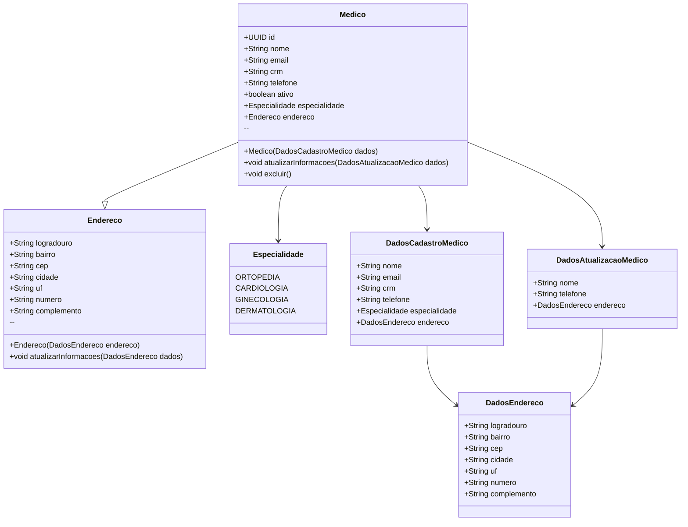

# 🩺API Voll Med - Consultas Médicas

Projeto de API CRUD simples utilizando Spring Boot e aplicando a metodologia do Git Flow junto ao uso do padrão de Conventional Commits e Semantic Versioning para melhor controle de versionamento e distribuição. Desenvolvido durante curso na Alura

# üõ† Tecnologias Utilizadas
 - SpringBoot com Maven
 - Lombok
 - JPA Bean Validation
 - Spring Security
 - JWT Tokens

# 📃 Diagrama

```mermaid
classDiagram
  class Medico {
    +UUID id
    +String nome
    +String email
    +String crm
    +String telefone
    +boolean ativo
    +Especialidade especialidade
    +Endereco endereco
    --
    +Medico(DadosCadastroMedico dados)
    +void atualizarInformacoes(DadosAtualizacaoMedico dados)
    +void excluir()
  }

  class Endereco {
    +String logradouro
    +String bairro
    +String cep
    +String cidade
    +String uf
    +String numero
    +String complemento
    --
    +Endereco(DadosEndereco endereco)
    +void atualizarInformacoes(DadosEndereco dados)
  }

  class Especialidade {
    ORTOPEDIA
    CARDIOLOGIA
    GINECOLOGIA
    DERMATOLOGIA
  }

  class DadosCadastroMedico {
    +String nome
    +String email
    +String crm
    +String telefone
    +Especialidade especialidade
    +DadosEndereco endereco
  }

  class DadosAtualizacaoMedico {
    +String nome
    +String telefone
    +DadosEndereco endereco
  }

  class DadosEndereco {
    +String logradouro
    +String bairro
    +String cep
    +String cidade
    +String uf
    +String numero
    +String complemento
  }

  Medico --|> Endereco
  Medico --> Especialidade
  Medico --> DadosCadastroMedico
  Medico --> DadosAtualizacaoMedico
  DadosCadastroMedico --> DadosEndereco
  DadosAtualizacaoMedico --> DadosEndereco

```

## 💻 Como Rodar?

1. Clone o repositório
```bash
git clone https://github.com/delmiraugusto/ApiJavaHospital.git
```
2. Basta iniciar a aplicação normalmente, utilizando a IDE preferida.

Por padrão, a aplicação é iniciada em http://localhost:8080/
